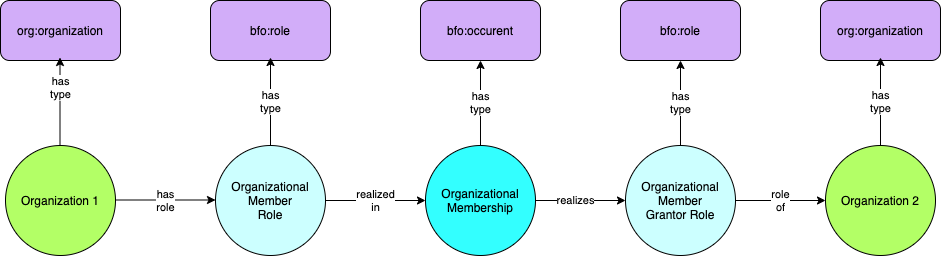

.. _associations:

.. index:: associations

Associations
=============

Associations of Organizations with other Organizations
-------------------------------------------------------

Organizations can be associated with each other in a variety of manners.  Here we
describe how to represent various associations between organizations.

Affiliation
...........

An organization can be affiliated with another organization.  In the Organization Ontology,
affiliation is a broad term and may mean and association that is not further specified.
The only restriction on affiliation is that it is *symmetric*.  If organization x is
affiliated with organization y, then organization x is affiliated with organization y.

We say simply

.. code-block::

    x a organization
    y a organization
    y affiliated_with x
    
for which we can infer [1]_:

.. code-block::

    x affiliated_with y

Structure
..........

Representing organizational structure is a common need.  The Organization Ontology
has two properties, has_organizational_part and organizational_part_of, to specify the 
relationship between an organizational part and its parent organization (which may also 
be an organizational part).

For example, if x represents Baylor University, and y represents its College of Medicine 
we would assert:

.. code-block:: 

    x has_organizational_part y

from which we could infer *y organizational_part_of x* [2]_.

Spin-offs
.........

Representing organizations that spin-off from other organizations is done
using *has spin-off organization" and *spin-off organization off* properties.

For example, to represent that y spun-off of x, we would assert:

.. code-block:: 

    y spin-off_organization_of x

from which we could infer *x has_spin-off_organization y* [2]_.

In some cases, we want to know more about the nature of the spin-off process, including
dates of various milestones, people who participated, documents involved, and more.
*spin-off process* is an entity in which other entities may participate, and as an
occurrent, may have one or more *spin-off process boundaries* as occurent parts. See
:doc:`Dates and Times <datetimes>` for representation of time-based entities.

History
.......

In some cases, we may wish to assert that organization y is the successor of organization
x, meaning that x has ceased to exist, y now exists, and that the result of the dissolution
of x was the formation of y.  The inverse of *successor_of* is *has_successor*.  We can say
either *y successor_of x* or *x has_successor y* [2]_.

We say:

.. code-block::

    x a organization
    y a organization
    y successor_of x
    
In some cases, we want to know more about the nature of the succession process, including
dates of various milestones, people who participated, documents involved, and more.
*succession process* is an entity in which other entities may participate, and as an
occurrent, may have one or more *succession process boundaries* as occurent parts. See
:doc:`Dates and Times <datetimes>` for representation of time-based entities.

Membership
..........

Organizations may be members of other organizations.  If x is a member of y, we can
simple say

.. code-block::

    x member_of y
    
and we can equivalently say *y has_member x* [2]_.

In some cases, we may need to know more about the membership, which is an 
asymmetric relationship of two organizations -- one organization is the member
and the other organization has granted membership to the member organization.

This is shown in `Figure 4`_.  Since Membership is an occurent, it can have 
time-related assertions.

.. _Figure 4:

    Figure 4.  General membership pattern.  Organization 1 has a member role in a
    membership.  Organization 2 has a grantor role in the membership.
    
To say that v was a member of z through a membership x, we would assert:

.. code-block::

    v bearer_of w
    w a organizational_member_role
    w realized_in x
    x a organizational_membership
    x realizes y
    y a organizational_membership_grantor_role
    y inheres_in z
    
Since each of these properties has an inverse, we could equivalently have asserted:

.. code-block::

    z bearer_of y
    y a organizational_membership_grantor_role
    y realized_in z
    x a organizational_membership
    x realizes w
    w a organizational_member_role
    w inheres_in x    

Note that this detail is typically only needed in cases where we wanted to say more 
about the roles, or membership entity.

Associations of Organizations and People
----------------------------------------

In a similar manner to the associations between organizations and organizations, we can
associate organizations and people.  And in a similar manner, we can simply 
say the organization has an association with a person, or we can use an intermediate
entity and roles to describe how the organization and person are related, providing
detail regarding dates, documents, processes, and participants in the association 
between an organization and a person.

Has Employee / Employer Of
..........................

To assert a person is an employee of an organization, we can simply say

.. code-block:: 

    x has_employee y
    
or, equivalently, we can say:

.. code-block::

    y has_employee x
    
The entity *position* is a relationship between a person and an organization.  A person
may one of several roles with respect to the position.  An organization may have
one of several roles with respect to the position.  See `Figure 5`_.

.. _Figure 5:

        -> organization role -> organization

    Figure 5.  General employee pattern.  Organization 1 has a member role in a
    membership.  Organization 2 has a grantor role in the membership.
    
To say that v was an employee of z through a position x, we would assert:

.. code-block::

    v bearer_of w
    w a organizational_employee_role
    w realized_in x
    x a organizational_position
    x realizes y
    y a organizational_employer_role
    y inheres_in z
    
Since each of these properties has an inverse, we could equivalently have asserted:

.. code-block::

    z bearer_of y
    y a organizational_employer_role
    y realized_in z
    x a organizational_position
    x realizes w
    w a organizational_employee_role
    w inheres_in x    

Note that this detail is typically only needed in cases where we wanted to say more 
about the roles, or membership entity.

Additional Roles and Associations between Organizations and People
..................................................................

Additional roles and properties are available to assert other associations
between organizations and people.

**has_member/ member_of** can be used to assert a person is a member of an 
organization.  **person_member_role** and 
**person_member_grantor_role** can be used as in `Figure 5`_ to assert 
that a person has a member role in an organization granted by the organization.
A membership denotes the association.

.. sidebar::  Persons are not Organizations

  Separate object properties are used to represent associations between organizations
  and other organizations, and associations between persons and organizations.  Separate 
  roles and entities
  are used to represent person roles in memberships and organizational roles in
  memberships.  Separate entities are used to describe a membership of an
  organization in another organization, and a membership of a person in an
  organization.

**has_associate / associate_of** can be used to assert a person is an associate of an 
organization.  **organizational_associate_role** and 
**organizational_associate_grantor_role** can be used as in `Figure 5`_ to assert 
that a person has an associate role in an organization granted by the organization.
The position denotes the association.

**head_of / has_head** can be used to assert a person is the head of an 
organization.  **organizational_head_role** and 
**organizational_head_grantor_role** can be used as in `Figure 5`_ to assert 
that a person has a head role in an organization granted by the organization.
The position denotes the relationship.

**has_volunteer / volunteer_of** can be used to assert a person is a volunteer of an 
organization.  **organizational_volunteer_role** and 
**organizational_volunteer_grantor_role** can be used as in `Figure 5`_ to assert 
that a person has a volunteer role in an organization granted by the organization.
The position denotes the relationship.

**has_appointee / appointee_of** can be used to assert a person is an appointee of an 
organization.  **organizational_appointee_role** and 
**organizational_appointee_grantor_role** can be used as in `Figure 5`_ to assert 
that a person has an appointee role in an organization granted by the organization.
The position denotes the association.

    
.. rubric:: Footnotes

.. [1] Some inferencers are able to create/materialize symmetric assertions.  Some query
       engines will satisfy query requirements as if the assertion had been materialized.
    
.. [2] Some inferencers are able to create/materialize inverse assertions.  Some query
       engines will satisfy query requirements as if the assertion had been materialized.