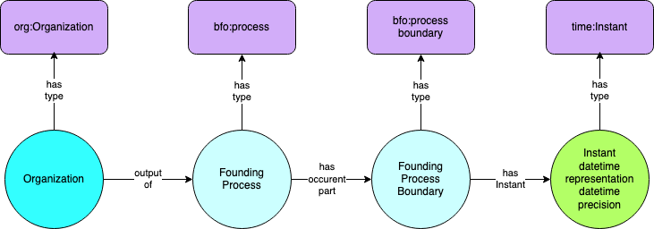

.. _datetimes:

.. index:: Dates, Times, Datetimes

Dates and Times
===============

The Organization Ontology uses the W3C Time Ontology [1]_ for representation of
dates and times.  The key entity is time:Instant, which may have a precision to
indicate whether we know the instant to a particular day, month, year, or with
more precision such as hour, minute, second, and so on.  The Time Ontology has sophisticated
semantics for many kinds of calendars.  The examples for the Organization 
Ontology assume Gregorian calendar.  Most time instants related to organizations are
at the day or year precision.  Assertions such as "This org was founded in that year"
are common.

BFO Date Semantics
------------------

BFO has "occurents" -- entities which occur in time.  The most important BFO entity
for organizations is ``BFO_000015`` -- process.  A process is an occurrent which 
has proper temporal parts and involves an entity as participant or output.  

In the ORG ontology, most processes of interest -- the creation of organizations, 
the dissolution of organizations, are
processes in which rights and privileges are obtained.  All
organizations have rights and privileges, either formally recognized in founding 
documents, or informally by word of mouth and personal agreements.  These are not
currently represented in the Organization Ontology, but are readily added.

Processes often have process boundaries (``BFO_000035``) as demarcations in a process, points
in time at which something occurred.  Process boundaries can have an 
associated time instant to indicate when the process boundary occurred.  
  
:ref:`Figure 3` shows the general pattern.  An organization is the output of a founding 
process.  The founding process has a process boundary which is
the moment in the process at which the organization comes into existence (the founding).
The founding has an associated time instant.  The instant has a datetime value and
a time precision.

.. _Figure 3:

    Figure 3.  General time pattern.  An organization is the output of a founding process.
    
*Implementation note:*  The colors in the figure represent dependency of entities.  The 
dark blue organization is the
entity of interest.  The light blue founding process and founding process boundary are 
dependent on
the object of interest.  In typical data systems, if the organization was removed from 
the system,
its founding process and founding process boundary would also be removed.  The datetime
instant would not be removed, it may be associated with other occurrents in the data 
system.
  
This representation achieves several goals:

#.  Uses BFO to represent time semantics, clarifying the nature of dates and what
    they represent using a consistent upper level ontology.
#.  Uses W3C Time Ontology to represent time values gaining richness of expression
    in the representation of date and time values.
#.  Provides the framework necessary to add additional detail regarding processes
    related to organizations, including additional processes, rights and privileges
    resulting from processes, additional milestones in processes,
    locations and participants of processes, documents and other participants and
    outputs of processes.
    
Example
-------

To assert that an organization x was founded in the year 1853, we would say:

.. code-block::

  x a organization
  x output_of y
  y a founding_process
  y has_occurent_part z
  z a founding_process_boundary
  z has_instant t
  t a instant
  t unit_type unit_year
  t has_xsd_datetme_stamp "1853"
  
*Implementation note 1:*  Some data systems may be pre-populated with instants
of year precision for years of interest.  In such a case the above example would
end with z has_instant t, where t is the pre-existing instant representing 1853 with
year precision.
  
*Implementation note 2:*  Some data system may require that time representations
be formatted in a particular way, for example W3C datetime standard, with a time zone,
even if the time precision is year only.  Elements of the time representation other
than the year would be ignored by the data system.  In such cases, the time representation
might be appear as "1853-01-01T00:00:01+00:00" for example.

Terms used to represent dates and times
---------------------------------------
  
:ref:`Table 11` lists terms used to represent dates and times

.. _Table 11:

.. table:: Table 11 Terms used to represent dates and times

    ============================= ===========================================================
    Term                          Notes
    ============================= ===========================================================
    :doc:`doc-RO_0002353`         output of
    :doc:`doc-RO_0002234`         has output
    :doc:`doc-BFO_0000015`        process
    :doc:`doc-ORG_0000040`        founding process
    :doc:`doc-ORG_2000003`        has occurent part
    :doc:`doc-RO_0002012`         occurent part of
    :doc:`doc-BFO_0000035`        process boundary
    :doc:`doc-ORG_0000041`        founding process boundary
    :doc:`doc-ORG_0000042`        dissolution process
    :doc:`doc-ORG_0000043`        dissolution process boundary
    :doc:`doc-ORG_2000003`        has instant.  Process boundaries have instants.
    :doc:`doc-Instant`            Instant
    :doc:`doc-inXSDDateTimeStamp` An xsd:datetimestamp string associated with an Instant
    :doc:`doc-unitType`           has datetime precision
    :doc:`doc-unitYear`           year precision
    :doc:`doc-unitMonth`          month precision
    :doc:`doc-unitDay`            day precision
    :doc:`doc-unitHour`           hour precision
    :doc:`doc-unitMinute`         minute precision 
    :doc:`doc-unitSecond`         second precision 
    ============================= ===========================================================

.. rubric:: Footnotes

.. [1] https://www.w3.org/TR/owl-time/

