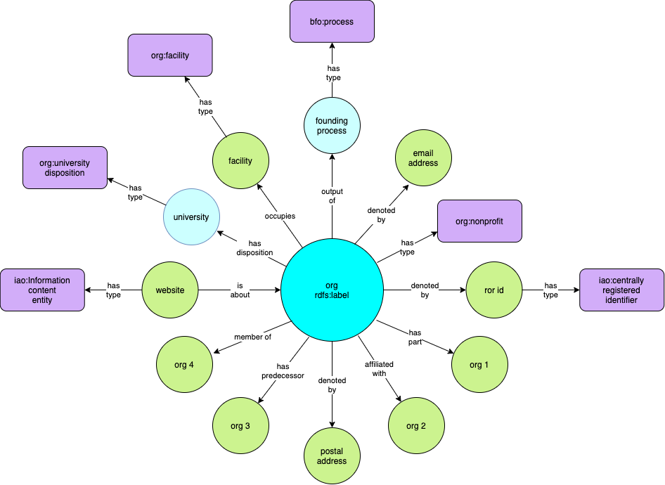

.. _organizations:

Organizations
=============

An organization is any collection of people with a purpose.  Organizations may be 
formal/legal, as in the case of universities and corporations, or they may be informal, 
as, for example, clubs.  Organizations may be parts of other organizations.

Subsumption 
----------------

Organizations are :ref:`generically dependent continuants <glossary>` [#]_ since they 
depend
on the people and documents which define them. All the people and documents may be 
replaced with
other people and documents, and the organization continues to exist.

Overview
----------

`Figure 1`_ shows the classes and properties used to represent organizations in ORG.
An overview of the classes and properties follows the figure.

.. _Figure 1:

    Figure 1.  Representation of organizations.  The organization of interest is at the 
    center of the figure.  See notes below.
    
At the center of the figure note that an organization has a name (rdfs:label).

An organization has a type.  In the figure, the type of the organization is 
org:non-profit.  See below for a further discussion of types.

Now proceeding clockwise from type:

- An organization may be denoted by one or more identifiers.  Identifiers are represented
  using the Identifier Ontology (IDO).  Note that the identifier is an entity.  It exists
  independently of the organization to denotes.
- Orgs may be related to other orgs.  An org may be part of another organization.
- An org may be affiliated with another organization.
- An org may be denoted by a postal address.  See :doc:`Addresses <addresses>` for 
  details.  Addresses have
  properties that indicate how they are to be used.
- An org may have a predecessor organization.  Organizations undergo change.  The 
  resulting
  organization may be a new organization of a different type, different people, different 
  purpose.
- An organization may be a member of another organization.
- Organizations often have web sites.  Web sites are information content entities that are
  about the organization.  Note that the web site is an entity that exists with or without
  the organization it is about.
- Organizations have one or more dispositions.  Dispositions identify the purpose of an
  organization.  Dispositions of an organization may change over time.  See below for a 
  further discussion of dispositions.  A disposition is dependent the entity which
  has the disposition.  In BFO, a disposition is a specifically dependent continuant,
  dependent on the entity which has the specific disposition.
- An org may occupy zero or more facilities, such as an office building, or university 
  campus. A facility
  is typically a man-made structure attached to the ground.  As such, facilities have
  geographical locations -- in cities, for example.  See :doc:`Facilities <facilities>` 
  for more detail.
- Organizations come into being as the result of founding processes which have associated 
  dates.  See :doc:`Dates and Times <datetimes>` for
  a further discussion of the representation of dates and times related to organizations.
- Organizations may be denoted by one or more email addresses.  See :doc:`Addresses 
  <addresses>` for details.  As with postal addresses, email addresses may have 
  properties describing their purpose.

    
Types
------

Organizations have one of the types in the table below. These are mutually exclusive.  
An organization can
not be more than one type, just as an animal cannot be more than one species.

.. include:: tab-all-types.txt
    
:ref:`Figure 2` shows the subsumption hierarchy for organization and its subclasses.

.. _Figure 2:

.. figure:: ../img/org-types.png
    :alt: Types of organizations.  A simple ball and stick diagram

    Figure 2.  Subclasses of organization and subsumption hierarchy.  The subclasses are 
    mutually exclusive.

Dispositions
------------

Organizations have dispositions which indicate the purposes organizations have.  An
organization might have a disposition of *library* or *healthcare* or *military*.
Dispositions are shown in :ref:`Table 2`  An organization may have any number 
of dispositions.

.. include:: tab-all-dispositions.txt

Examples
--------

.. topic:: Duke University

    Duke is a non-profit with a dispositions of university, education, and research
    
    Duke has an organization part, Duke Health, which has a disposition of
    healthcare.  Duke Health has an organizational part, Duke University Hospital,
    which has a disposition of hospital.
    
.. topic:: United States Navy

    The United States Navy is an organization part of the US Department of Defense 
    with disposition of military.
    
.. topic:: BASF

    BASF is a company with a disposition of commerce.
    
Qualities
---------

Qualities are realized entities that do not require a process, and can be added or
subtracted from an entity without altering the entity.  Use the :doc:`has quality 
<doc-RO_0000086>` property to associate a quality with an entity.

For example, to assert organization x is student-led:

.. code-block::

    x has_quality y
    y a student_led_organization_quality

.. include:: tab-all-qualities.txt

.. rubric:: Footnotes

.. [#] By OBO-complaint, we mean the ORG ontology has been developed in accordance with
   |OBOP|_.

.. [#] The OBO community is having an on-going conversation about the subsumption of
   organization.  OBI defines organization as a material entity.  The VIVO Project 
   disagrees with this
   assertion, as organizations can not be weighed, put in a box, or otherwise measured as
   material entities.  Their generic reliance on people *and* documents/understandings of 
   purpose seems to indicate that they are generically dependent on these components.